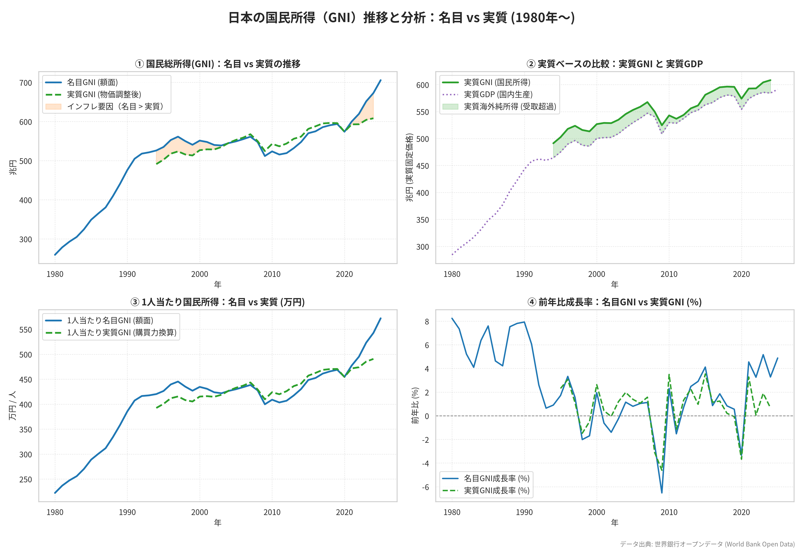

# 日本の国民所得（GNI）推移と構造分析

世界銀行オープンデータ（World Bank Open Data）APIから日本の経済データを取得し、国民総所得（GNI）、国内総生産（GDP）、海外からの純所得（一次所得収支）、1人当たり国民所得の推移を可視化するプロジェクトです。

Pythonスクリプトは **PEP 723 (Inline script metadata)** に対応しており、パッケージの事前インストール不要で **`uv`** を使って即座に実行できます。

---

## 📊 可視化グラフ



### 主な着眼点
1. **国民総所得（GNI）と国内総生産（GDP）の乖離**:
   - 近年、日本の名目GNIは名目GDPを大きく上回っています（2025年実績でGNI約705.7兆円に対し、GDPは約663.8兆円）。
2. **海外からの純所得の拡大**:
   - その差分である海外からの純所得（第一次所得収支黒字＝対外直接投資や証券投資からの利子・配当など）は年間 **+41.9兆円** 規模に達し、日本経済が「貿易立国」から「投資立国」へ変化した実態を表しています。
3. **1人当たり国民総所得**:
   - 日本円ベースでは直近で約572万円に達する一方、ドル換算では為替変動（円安）の影響を受けています。

---

## 🚀 実行方法

本プロジェクトのPythonスクリプトは [PEP 723](https://peps.python.org/pep-0723/) に準拠しています。[`uv`](https://github.com/astral-sh/uv) がインストールされていれば、以下のコマンドだけで依存関係の解決と実行が行われます。

```bash
# スクリプトの実行（グラフ画像 japan_national_income.png と Web用 data.json を生成）
uv run visualize_national_income.py
```

### 依存関係（PEP 723）
```python
# /// script
# requires-python = ">=3.10"
# dependencies = [
#     "matplotlib",
#     "pandas",
#     "requests",
#     "seaborn",
# ]
# ///
```

---

## 🌐 GitHub Pages

本リポジトリは GitHub Pages にてWeb版ダッシュボード（Chart.jsによるインタラクティブグラフ）を公開しています。

- **URL**: https://katzkawai.org/japan-national-income/ (または https://katzkawai.github.io/japan-national-income/ )

---

## 📁 ファイル構成

```text
├── visualize_national_income.py  # PEP 723対応 Python可視化スクリプト
├── index.html                    # GitHub Pages用 インタラクティブダッシュボード
├── data.json                     # スクリプトから出力された年次経済データ
├── japan_national_income.png     # Python (Matplotlib) で生成された4面グラフ画像
└── README.md                     # 本ドキュメント
```

---

## 📜 出典

- [World Bank Open Data](https://data.worldbank.org/) (Indicators: `NY.GNP.MKTP.CN`, `NY.GDP.MKTP.CN`, `NY.GNP.PCAP.CN`, `NY.GNP.MKTP.CD`, `NY.GNP.PCAP.CD`)
